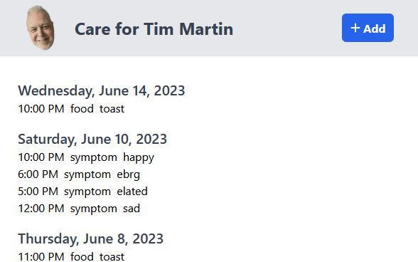

# Care

Web application for logging medical events for my dad.

URL: https://care.tim-martin.com/



RIP, dad, 1953-01-03 to 2023-06-11


## Event

Examples:

- Gave 5 mg of morphine, or 2 mg of lorazepam
- Feeling nauseous, or had diarrhea, or vomited, or constipated, or good stool
- Ate a popsicle, or ate toast

I guess I want to track when medications are given, when symptoms are felt, and when food is eaten.

Each event has a timestamp, a type (medication, symptom, food), and a description.

## Architecture

As a first attempt, I'll use:

- SvelteKit for the frontend
- Firestore
- Vercel for hosting


## Developing

Once you've created a project and installed dependencies with `npm install` (or `pnpm install` or
`yarn`), start a development server:

```bash
npm run dev

# or start the server and open the app in a new browser tab
npm run dev -- --open
```

## Building

To create a production version of your app:

```bash
npm run build
```

You can preview the production build with `npm run preview`.

> To deploy your app, you may need to install an [adapter](https://kit.svelte.dev/docs/adapters) for
> your target environment.
